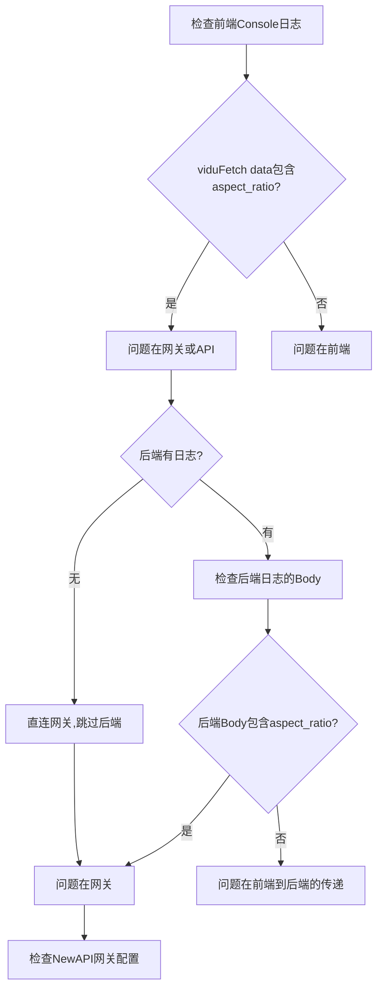

# Vidu请求完整链路调试指南

## 📋 完整请求链路

```
用户操作 → 前端UI → 前端API → HTTP请求 → 后端代理/直连 → NewAPI网关 → Vidu官方API
                                                    ↓
用户看到结果 ← 前端UI ← 前端API ← HTTP响应 ← 后端代理 ← NewAPI网关 ← Vidu官方API
```

## 🔍 逐环节调试

### 环节1️⃣：前端UI（viduInput.vue）

**位置**: `src/views/luma/viduInput.vue:98`

**检查点**: 用户选择的`aspect_ratio`是否正确传递

**调试方法**:
```javascript
// 第79行添加日志
mlog('vidu generate', vidu.value);
// 应该输出: { aspect_ratio: "9:16", model: "viduq1", ... }
```

**验证**:
- 打开浏览器F12 → Console
- 点击生成按钮
- 查找日志: `vidu generate`
- **确认**: `aspect_ratio` 的值是否为 `"9:16"`

**可能问题**:
- ❌ `aspect_ratio: "16:9"` → UI组件没有更新状态
- ❌ `aspect_ratio: undefined` → 绑定失败

---

### 环节2️⃣：前端API（vidu.ts - viduGenerate）

**位置**: `src/api/vidu.ts:98-112`

**检查点**: 构建的`requestData`是否包含正确的参数

**当前日志**:
```typescript
// 第98行
mlog('viduGenerate', params);
// 输出: { aspect_ratio: "9:16", images: [...], ... }
```

**验证**:
- 浏览器Console查找: `viduGenerate`
- **确认**: `params.aspect_ratio` 是 `"9:16"`

**关键代码**:
```typescript
const requestData: any = {
  model: params.model,
  prompt: params.prompt,
  aspect_ratio: params.aspect_ratio || '16:9',  // ⚠️ 检查这里
  duration: params.duration || 5,
  // ...
};
```

**可能问题**:
- ❌ `aspect_ratio: "16:9"` → 使用了默认值，说明`params.aspect_ratio`为空

---

### 环节3️⃣：HTTP请求（viduFetch）

**位置**: `src/api/vidu.ts:51-80`

**检查点**: 实际发送的请求体

**当前日志**:
```typescript
// 第53行
mlog('viduFetch data:', JSON.stringify(data, null, 2));
// 第67行
mlog('viduFetch final URL:', finalUrl);
```

**验证**:
- 浏览器Console查找: `viduFetch data:`
- **确认**: JSON中包含 `"aspect_ratio": "9:16"`
- **确认**: URL指向哪里（本地代理 or 直连网关）

**示例输出**:
```json
{
  "model": "viduq1",
  "aspect_ratio": "9:16",
  "duration": 5,
  "images": ["ssupload:?id=..."],
  "mode": "reference"
}
```

**URL判断**:
```typescript
// 如果有 OPENAI_API_BASE_URL 配置
finalUrl: "https://你的网关地址/v1/video/generations"  // 直连网关

// 如果没有配置
finalUrl: "/v1/video/generations"  // 走本地代理
```

---

### 环节4️⃣：本地后端代理（可选）

**位置**: `service/src/index.ts:431-478`

**检查点**: 后端是否收到并转发了正确的参数

**添加调试日志**:

```typescript
// 第434行后添加
console.log('🎬 NewAPI Vidu 视频生成请求:')
console.log('Headers:', req.headers)
console.log('Body:', JSON.stringify(req.body, null, 2))  // ⚠️ 已有
```

**验证**:
- 查看后端控制台（运行`cd service && pnpm dev`的终端）
- 应该看到:
```
🎬 NewAPI Vidu 视频生成请求:
Body: {
  "model": "viduq1",
  "aspect_ratio": "9:16",  // ⚠️ 检查这里
  ...
}
```

**关键代码**:
```typescript
// 第456行 - 直接透传请求体
body: JSON.stringify(req.body)
```

**可能问题**:
- ❌ 后端日志中没有`aspect_ratio` → 前端没发送
- ❌ 后端没有日志 → 请求直连网关，跳过了后端代理

---

### 环节5️⃣：NewAPI网关

**位置**: 你的NewAPI服务器

**检查点**: 网关是否接收并正确转发参数

**调试方法**:

1. **查看NewAPI网关日志**:
```bash
# 连接到NewAPI服务器
ssh your-server

# 查看实时日志
tail -f /path/to/newapi/logs/app.log
# 或
docker logs -f newapi-container
```

2. **检查网关配置**:
```bash
# NewAPI的Vidu配置文件
cat /path/to/newapi/config/vidu.yaml
```

**关键检查**:
- 网关是否接收到 `aspect_ratio: "9:16"`
- 网关是否将其转换为Vidu官方API格式
- 网关是否有参数过滤/映射规则

**NewAPI网关可能的问题**:
1. **参数映射错误**:
   ```yaml
   # 错误的映射
   aspect_ratio → size  # 可能只认size，丢弃了aspect_ratio
   ```

2. **参数白名单**:
   ```yaml
   # 只允许特定参数
   allowed_params:
     - model
     - prompt
     - duration
     # ❌ 缺少 aspect_ratio
   ```

3. **默认值覆盖**:
   ```yaml
   # 网关强制使用默认值
   defaults:
     aspect_ratio: "16:9"  # ⚠️ 覆盖了用户设置
   ```

---

### 环节6️⃣：Vidu官方API

**位置**: Vidu官方服务器（无法直接访问）

**检查点**: 通过响应推断API是否收到正确参数

**验证方法**:

1. **查看API响应**:
   - 浏览器F12 → Network → 找到`/v1/video/generations`请求
   - 查看Response:
   ```json
   {
     "task_id": "...",
     "aspect_ratio": "16:9",  // ⚠️ 如果这里是16:9，说明API没收到9:16
     "state": "created"
   }
   ```

2. **等待视频生成完成**:
   - 下载生成的视频
   - 查看视频文件属性（右键 → 属性 → 详细信息）
   - **确认实际分辨率**:
     - 9:16应该是 `1080x1920`
     - 16:9应该是 `1920x1080`

---

## 🎯 问题定位策略

### 策略1：二分法定位



### 策略2：对比测试

**测试1：文生视频（无图片）**
```
目的: 验证参数传递链路是否正常
步骤:
1. 不上传图片
2. 选择9:16
3. 只输入提示词
4. 生成视频
5. 检查生成的视频是否为9:16
```

**测试2：检查网络请求**
```
浏览器F12 → Network → 找到请求 → 查看:
- Request Headers
- Request Payload (查看aspect_ratio值)
- Response (查看aspect_ratio值)
```

---

## 📝 完整调试检查清单

### ✅ 前端检查
- [ ] Console有`vidu generate`日志
- [ ] `vidu.value.aspect_ratio === "9:16"`
- [ ] Console有`viduGenerate`日志
- [ ] `params.aspect_ratio === "9:16"`
- [ ] Console有`viduFetch data:`日志
- [ ] JSON中包含`"aspect_ratio": "9:16"`
- [ ] F12 Network中请求载荷包含`aspect_ratio: "9:16"`

### ✅ 后端检查（如果走后端代理）
- [ ] 后端控制台有请求日志
- [ ] `req.body.aspect_ratio === "9:16"`
- [ ] 转发给网关的请求包含`aspect_ratio`

### ✅ 网关检查
- [ ] 网关日志显示接收到`aspect_ratio: "9:16"`
- [ ] 网关配置允许`aspect_ratio`参数
- [ ] 网关没有默认值覆盖
- [ ] 网关正确转发给Vidu API

### ✅ API响应检查
- [ ] 响应中的`aspect_ratio`值（即使是默认值也能说明问题）
- [ ] 生成的视频实际分辨率

---

## 🔧 快速诊断命令

### 1. 检查当前配置
```bash
# 检查前端是否配置了直连网关
grep -r "OPENAI_API_BASE_URL" .env*

# 检查后端配置
grep -r "OPENAI_API_BASE_URL" service/.env*
```

### 2. 添加临时调试日志

**前端** (`src/api/vidu.ts:112`后添加):
```typescript
console.log('🟢 [DEBUG] requestData:', JSON.stringify(requestData, null, 2));
```

**后端** (`service/src/index.ts:456`前添加):
```typescript
console.log('🔵 [DEBUG] 转发给网关的数据:', JSON.stringify(req.body, null, 2));
```

### 3. 网络请求抓包

```bash
# 如果需要更详细的网络调试
# 可以使用Charles或Wireshark抓包查看实际HTTP请求
```

---

## 💡 常见问题排查

### 问题1：前端选择了9:16，但日志显示16:9
**原因**: UI组件状态没更新
**排查**:
```javascript
// viduInput.vue第153行的点击事件
@click="(vidu.images.length === 0 || vidu.images.length >= 3) && (vidu.aspect_ratio = item.value)"
```
- 检查点击时是否满足条件
- 检查3张图片时是否可点击

### 问题2：前端发送正确，后端收到错误
**原因**: HTTP代理层修改了请求
**排查**:
- 检查是否有其他代理/中间件
- 检查Nginx/Apache配置

### 问题3：后端转发正确，网关返回默认值
**原因**: NewAPI网关配置问题
**解决**:
1. 检查网关的Vidu配置
2. 查看网关参数映射规则
3. 联系网关管理员

---

## 🎬 下一步行动

根据检查结果：

| 现象 | 问题位置 | 解决方案 |
|------|---------|---------|
| 前端日志就是16:9 | 前端UI | 检查组件绑定 |
| 前端9:16, viduFetch是16:9 | 前端API | 检查参数传递 |
| 前端正确, 后端收到16:9 | HTTP传输 | 检查代理配置 |
| 后端正确, API响应16:9 | 网关 | **检查NewAPI配置** ⚠️ |
| API响应正确, 视频是16:9 | Vidu API | 联系Vidu技术支持 |

---

## 📞 技术支持

如果以上步骤都无法定位问题，请提供：

1. 前端Console完整日志（包括`viduGenerate`和`viduFetch data:`）
2. 浏览器F12 Network中的完整请求/响应
3. 后端控制台日志（如果有）
4. NewAPI网关配置文件（如果可以访问）
5. 生成视频的实际分辨率

这将帮助进一步诊断问题。
